# Universidad de San Carlos de Guatemala
## Facultad de Ingeniería
### Escuela de Ciencias y Sistemas

---

# Práctica 2
## Consultas avanzadas, agrupaciones y reportería relacional
### Sistema de Gestión de EPS de Institutos Técnicos
### Bases de Datos 1 — Segundo Semestre 2026

| Dato | Valor |
|---|---|
| **Estudiante** | Josue Daniel Herrera Cottom |
| **Carné** | 202300689 |
| **Herramientas** | Oracle Database 21c XE + Oracle SQL Developer |
| **Fuente de datos** | `Dataset_Practica2.xlsx` |
| **Entrega** | `[BD1]_Practica2_202300689.zip` |

> Las figuras de este manual se van completando con las capturas tomadas en Oracle SQL Developer durante la carga y las consultas.

---

# 1. Introducción y marco teórico

## 1.1 De la Práctica 1 a la Práctica 2

La Práctica 1 entregó el **modelo físico** del sistema EPS (11 tablas, PK/FK/CHECK) y el script `DDL.sql`. La Práctica 2 **no vuelve a modelar desde cero**: pide poblar ese modelo con un dataset oficial y resolver cinco reportes DQL para la Dirección Académica.

El enunciado de P2 es explícito: *“En base al modelo relacional construido e implementado durante la Práctica 1”*. La rúbrica 2.1, sin embargo, penaliza si *“no se adaptó a los registros”*. Esa aparente contradicción se resuelve así:

1. Se conserva el **dominio** de P1 (empresa, plaza, estudiante, colocación, bitácora, evaluación).
2. Se **adapta el DDL** al Excel, porque el archivo oficial ya viene en 3FN con catálogos que en P1 estaban embebidos como `VARCHAR2`/`CHECK`.

Eso no contradice P1: el enunciado de P1 **exigía 3FN**. Extraer `SECTOR_ECONOMICO`, `DEPARTAMENTO`/`MUNICIPIO`, `ESTADO_COLOCACION` y `TIPO_EVALUACION` es precisamente llevar a tablas lo que en P1 se documentó como supuesto (opción B geográfica y dominios por `CHECK`).

## 1.2 Qué cambió respecto al ZIP de la Práctica 1

El ZIP `[BD1]_Practica1_202300689.zip` contiene: `Diccionario.pdf`, `ModeloConceptual.png`, `ModeloLogico.png`, `ModeloRelacional.png`, `DDL.sql`.

| P1 (DDL entregado) | P2 (hojas del Excel) | Motivo |
|---|---|---|
| `EMPRESA.sector_economico` (`CHECK`) | `SECTOR_ECONOMICO` + `EMPRESA.id_sector` | Catálogo 3FN; el Excel trae 5 sectores (aparece Agricultura) |
| `ESTUDIANTE.departamento` / `municipio_residencia` | `DEPARTAMENTO` → `MUNICIPIO` → `ESTUDIANTE.id_municipio` | El enunciado de P1 no exigía catálogo; el dataset sí |
| `COLOCACION.estado` (`CHECK`) | `ESTADO_COLOCACION` + `COLOCACION.id_estado` | Catálogo; IDs 1=Activa, 2=Finalizada, 3=Cancelada |
| `EVALUACION.tipo` (`CHECK`) | `TIPO_EVALUACION` + `EVALUACION.id_tipo_evaluacion` | Catálogo; además aparece `fecha_evaluacion` |
| `CRITERIO_EVALUACION` | `CRITERIO` | Mismo concepto, nombre de hoja |
| `INSTITUTO_TECNICO` | `INSTITUTO` | Mismo concepto |
| `CATEDRATICO_SUPERVISOR` | `CATEDRATICO` (`especialidad`, no `especialidad_que_supervisa`) | Mismo concepto |
| `PLAZA_PRACTICA` | `PLAZA` (`especialidad_tecnica`) | Mismo concepto |
| `ESTUDIANTE.primera_practica_repitencia` (`'Primera'`/`'Repitencia'`) | `ESTUDIANTE.es_repitencia` (`0`/`1`) | Consulta 4 exige `es_repitencia = 1` |
| (no había FK instituto–estudiante) | `ESTUDIANTE.id_instituto` | Consulta 4 pide el instituto de procedencia |
| `COLOCACION.carne` | `COLOCACION.id_estudiante` | El Excel usa este nombre; el valor sigue siendo el carné |
| `BITACORA.id_contacto` | `BITACORA.id_contacto_validador` | Mismo rol (quién valida) |

Sin esa adaptación, el asistente de importación falla: columnas que no existen, `CHECK` que rechaza `'Agricultura y Agroindustria'`, y `es_repitencia` inexistente.

## 1.3 Objetivos

**General.** Poblar el esquema EPS en Oracle respetando integridad referencial y producir cinco reportes DQL con JOIN explícito y agregación donde corresponda.

**Específicos.**

1. Adaptar el DDL de P1 a las 16 hojas del dataset.
2. Importar en orden topológico de FKs con el asistente de SQL Developer.
3. Resolver los 5 reportes del enunciado §3.1.
4. Documentar el procedimiento y las evidencias.

## 1.4 Integridad referencial (teoría que se defiende)

Una `FOREIGN KEY` se valida **en cada INSERT**. Si el padre no existe, Oracle responde:

```text
ORA-02291: integrity constraint (...) violated - parent key not found
```

Por eso el orden de carga no es estético: es el orden del grafo de dependencias. Deshabilitar constraints para “cargar en cualquier orden” oculta errores de mapeo y no cumple la rúbrica de importación.

## 1.5 Entorno

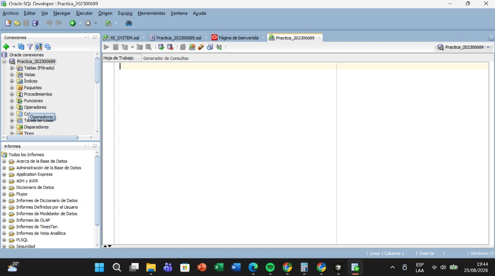

*Figura 1. Conexión `Practica_202300689` activa en Oracle SQL Developer.*

---

# 2. Guía de importación

## 2.0 Paso previo obligatorio: adaptar el esquema

1. Abrir `DDL_Adaptacion.sql` (script de trabajo; **no** va en el ZIP).
2. Ejecutarlo con el usuario de práctica (`F5`). Elimina las tablas de P1 y crea las 16 tablas del Excel.
3. Verificar:

```sql
SELECT table_name FROM user_tables ORDER BY table_name;
```

Deben aparecer: `SECTOR_ECONOMICO`, `DEPARTAMENTO`, `MUNICIPIO`, `ESTADO_COLOCACION`, `TIPO_EVALUACION`, `CRITERIO`, `INSTITUTO`, `EMPRESA`, `CATEDRATICO`, `CONTACTO_EMPRESARIAL`, `ESTUDIANTE`, `PLAZA`, `COLOCACION`, `BITACORA`, `EVALUACION`, `DETALLE_EVALUACION`.

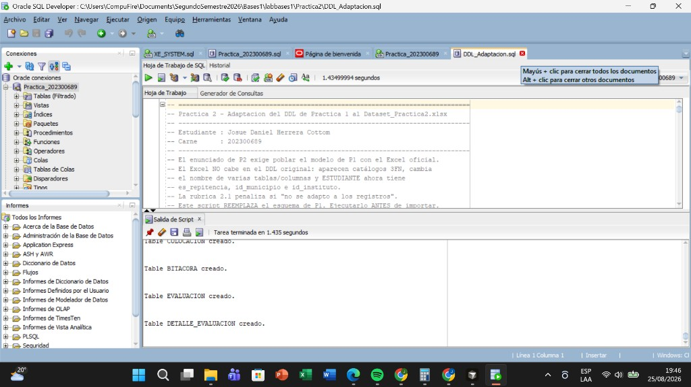

*Figura 2. Ejecución de `DDL_Adaptacion.sql`: las tablas del esquema adaptado se crearon sin error.*

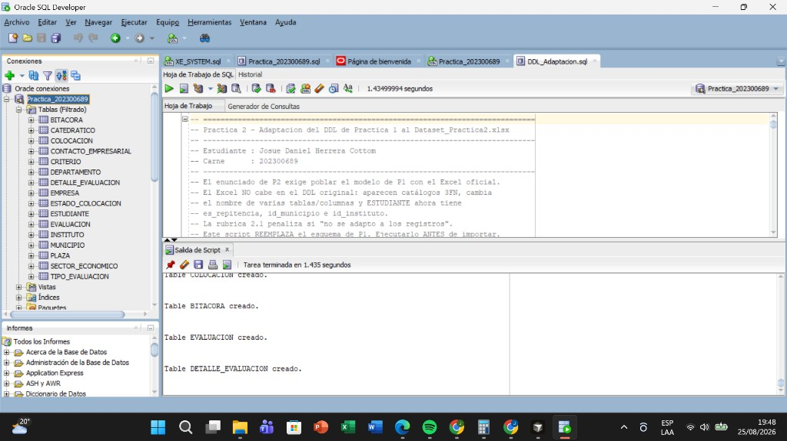

*Figura 2b. Las 16 tablas aparecen en el navegador de la conexión `Practica_202300689`, listas para recibir datos.*

## 2.1 Por qué el orden es estricto

Oracle valida cada `INSERT` en el momento. Si el padre no existe, responde:

```text
ORA-02291: integrity constraint (...) violated - parent key not found
```

La figura siguiente resume las llaves foráneas del esquema adaptado al dataset. **La flecha apunta al hijo:** el recuadro de origen se importa primero.

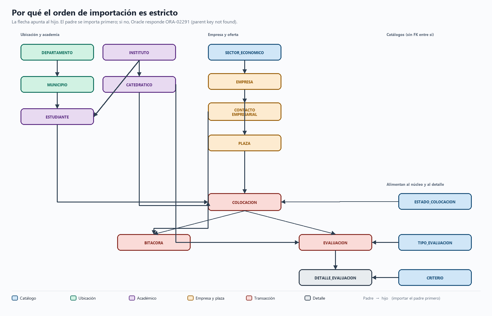

*Figura 3. Dependencias de integridad referencial. Los catálogos de la derecha (estado, tipo y criterio) no dependen entre sí; cada uno alimenta una tabla distinta.*

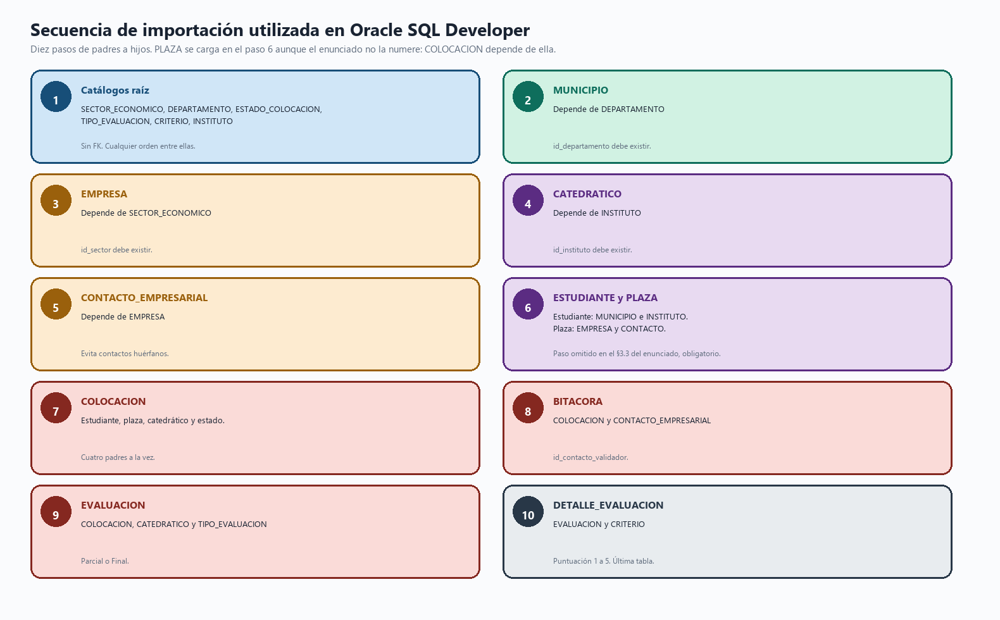

*Figura 3b. Orden jerárquico utilizado en Oracle SQL Developer. El paso 6 incluye `PLAZA`, omitida en el §3.3 del enunciado pero exigida por `COLOCACION.id_plaza`.*

## 2.2 Orden de carga (el del enunciado, con la corrección de PLAZA)

El §3.3 del enunciado lista el orden sugerido. Ese listado **omite `PLAZA`**, pero `COLOCACION` depende de `id_plaza`. Si se carga colocación sin plazas, aparece `ORA-02291`. `PLAZA` se inserta como paso 6, después de `CONTACTO_EMPRESARIAL` (porque también depende de `id_contacto`).

| Paso | Tabla | Filas reales del dataset | Depende de |
|---|---|---|---|
| **1** | `SECTOR_ECONOMICO`, `DEPARTAMENTO`, `ESTADO_COLOCACION`, `TIPO_EVALUACION`, `CRITERIO`, `INSTITUTO` | 5 / 4 / 3 / 2 / 5 / 3 | Ninguna (catálogos) |
| **2** | `MUNICIPIO` | 8 | `DEPARTAMENTO` |
| **3** | `EMPRESA` | 5 | `SECTOR_ECONOMICO` |
| **4** | `CATEDRATICO` | 5 | `INSTITUTO` |
| **5** | `CONTACTO_EMPRESARIAL` | 7 | `EMPRESA` |
| **6** | `ESTUDIANTE` y **`PLAZA`** | 7 y 7 | Estudiante: `MUNICIPIO`, `INSTITUTO`. Plaza: `EMPRESA`, `CONTACTO_EMPRESARIAL` |
| **7** | `COLOCACION` | 7 | `ESTUDIANTE`, `PLAZA`, `CATEDRATICO`, `ESTADO_COLOCACION` |
| **8** | `BITACORA` | 9 | `COLOCACION`, `CONTACTO_EMPRESARIAL` |
| **9** | `EVALUACION` | 4 | `COLOCACION`, `CATEDRATICO`, `TIPO_EVALUACION` |
| **10** | `DETALLE_EVALUACION` | 17 | `EVALUACION`, `CRITERIO` |

### Trampa del Excel oficial

Varias hojas tienen rango usado hasta la fila 1000 con celdas vacías. Si se importa el `.xlsx` completo, el asistente intentará insertar cientos de filas con PK nula (`ORA-01400`).

**Procedimiento seguro:** importar los CSV de `datos_limpios\` (misma información, solo filas con datos, UTF-8, fechas `YYYY-MM-DD`). Alternativa: en Excel, copiar únicamente el bloque con datos a una hoja nueva.

`COLOCACION` trae `FECHA_FINALIZACION` vacía en las colocaciones 4, 5 y 7. Eso es válido: la columna admite `NULL`. No convertir el vacío en `0` ni en `'01/01/0001'`.

## 2.3 Procedimiento ilustrado del asistente

El flujo se **repite por cada tabla**, en el orden de la sección 2.2.

### A. Abrir el asistente

Clic derecho sobre la tabla destino → **Import Data...**

El asistente se abrió con clic derecho sobre la tabla destino → **Importar datos...**. En todas las cargas se dejó el método **Insert** (valor por defecto al pulsar Siguiente) y el mapeo automático de columnas, porque los CSV de `datos_limpios` usan los mismos nombres que el DDL (`ID_SECTOR` → `ID_SECTOR`, `ID_CONTACTO_VALIDADOR` → `ID_CONTACTO_VALIDADOR`, etc.). La evidencia de que ese flujo funcionó son las importaciones confirmadas de las figuras 7 a 8d y el preview de la figura 4.

### B. Archivo fuente

Browse → CSV de `datos_limpios\NOMBRE_TABLA.csv`. Marcar *Header row*. Codificación **UTF-8**. Formato de fecha **`YYYY-MM-DD`**.

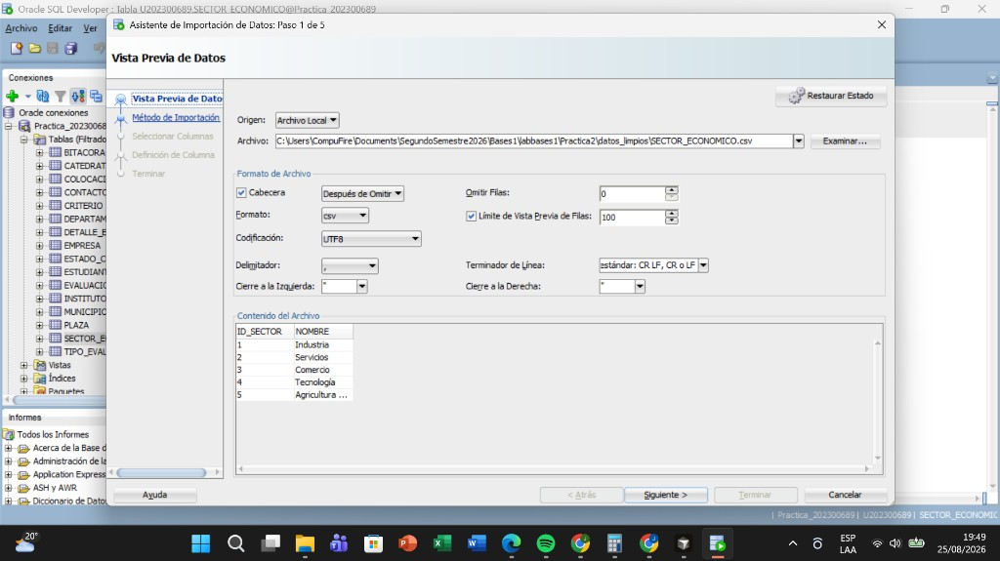

*Figura 4. Asistente de importación, paso 1: archivo `SECTOR_ECONOMICO.csv`, UTF-8, encabezado activo y 5 filas de preview.*

### C. Método

Dejar **Insert**. No truncar padres que ya tengan hijos. No deshabilitar constraints.

*El método de importación utilizado en todas las tablas fue Insert, confirmado por el mensaje de transacción al finalizar cada carga.*

### D. Mapeo

Cada columna del archivo debe coincidir con la columna Oracle (`ID_CONTACTO_VALIDADOR` → `ID_CONTACTO_VALIDADOR`, no a `ID_CONTACTO`). En `ESTUDIANTE`, `ES_REPITENCIA` es numérico `0`/`1`. En `COLOCACION`, `ID_ESTUDIANTE` mapea al carné.

*El mapeo de columnas coincidió automáticamente con el DDL adaptado; no fue necesario reasignar FKs a mano.*

### E. Verificar y ejecutar

*Finish* → log sin `ORA-02291` ni `ORA-00001`.


*Figura 7. Importación confirmada de `SECTOR_ECONOMICO` (catálogo padre, sin FK).*

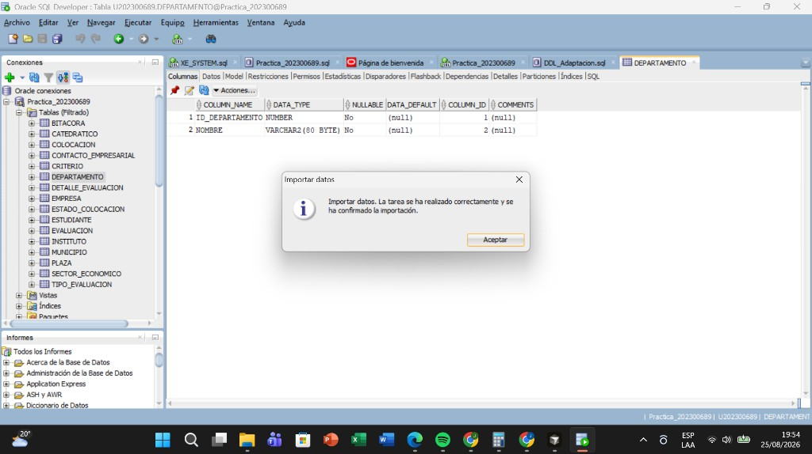

*Figura 7b. Importación confirmada de `DEPARTAMENTO`.*


*Figura 7c. Importación confirmada de `ESTADO_COLOCACION`.*

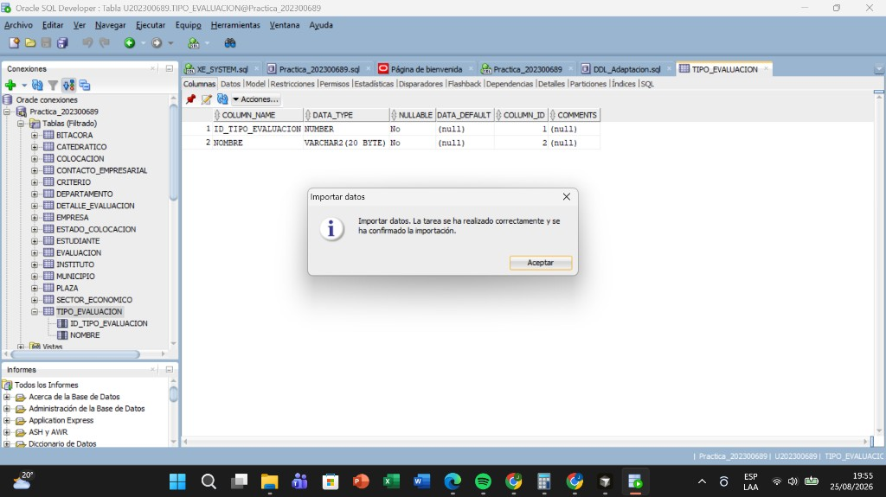

*Figura 7d. Importación confirmada de `TIPO_EVALUACION`.*

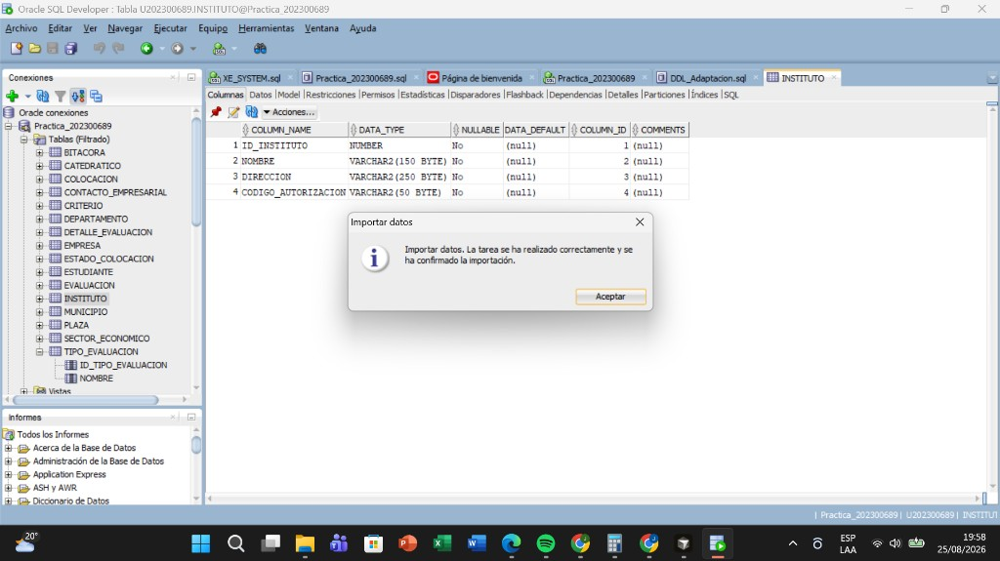

*Figura 7e. Importación confirmada de `INSTITUTO`.*

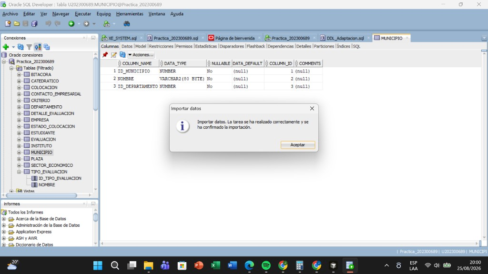

*Figura 7f. Importación confirmada de `MUNICIPIO` (primera tabla con FK hacia `DEPARTAMENTO`).*

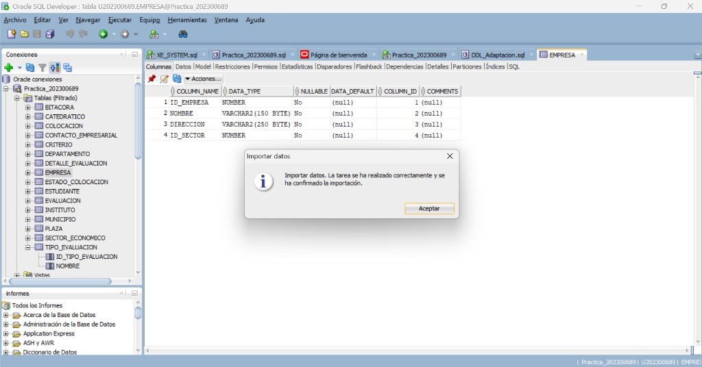

*Figura 7g. Importación confirmada de `EMPRESA` (FK hacia `SECTOR_ECONOMICO`).*

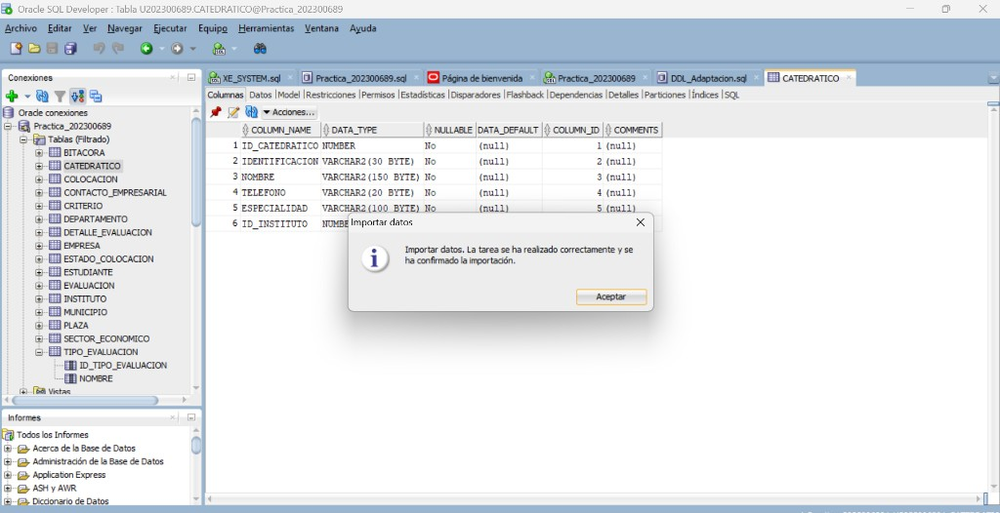

*Figura 7h. Importación confirmada de `CATEDRATICO` (FK hacia `INSTITUTO`).*

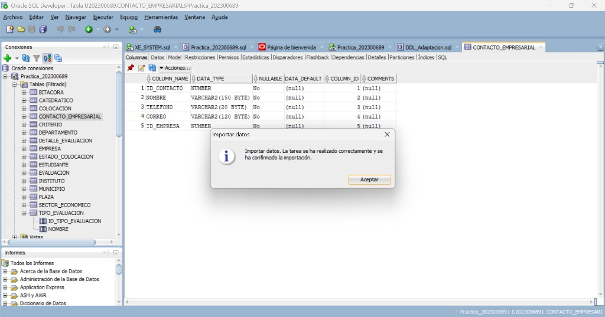

*Figura 7i. Importación confirmada de `CONTACTO_EMPRESARIAL` (FK hacia `EMPRESA`).*

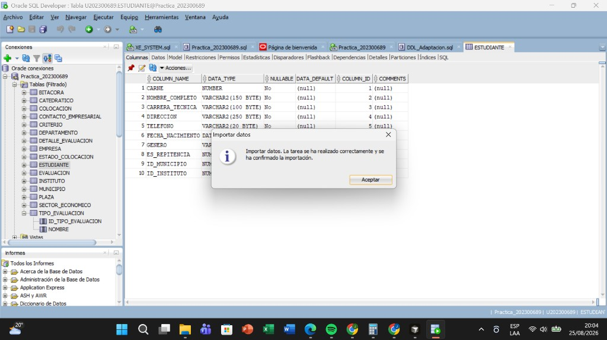

*Figura 7j. Importación confirmada de `ESTUDIANTE`. El asistente reconoció las fechas `YYYY-MM-DD` sin pedir formato extra.*

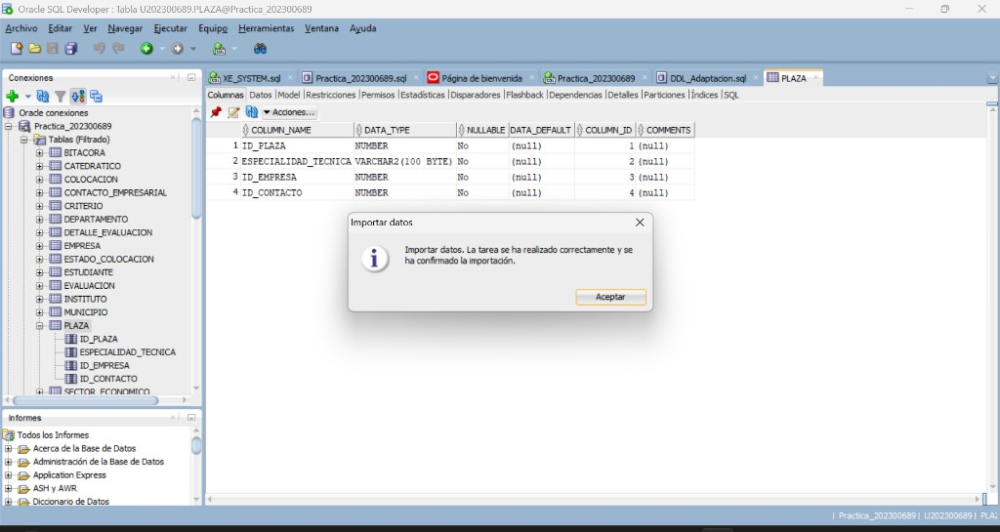

*Figura 7k. Importación confirmada de `PLAZA`, paso previo obligatorio a `COLOCACION`.*

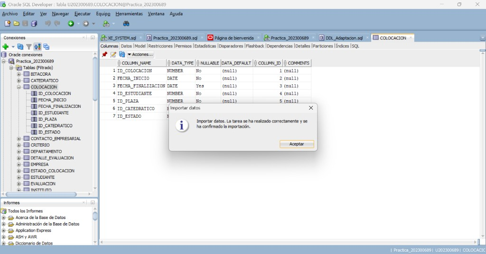

*Figura 8. Importación confirmada de `COLOCACION`. Las cuatro FK ya existían, por eso no hubo `ORA-02291`.*

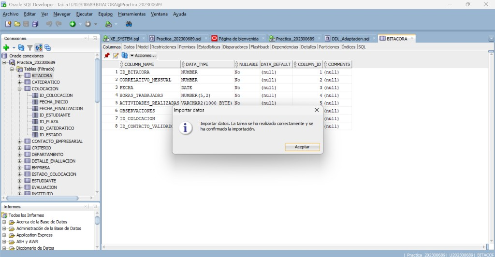

*Figura 8b. Importación confirmada de `BITACORA` (FK hacia colocación y contacto validador).*

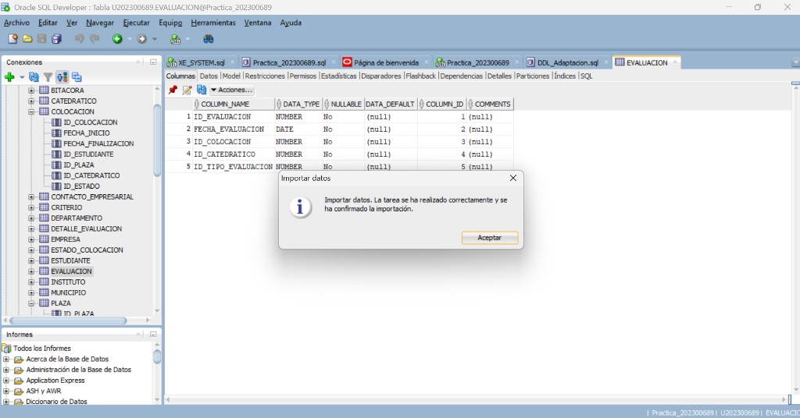

*Figura 8c. Importación confirmada de `EVALUACION`.*

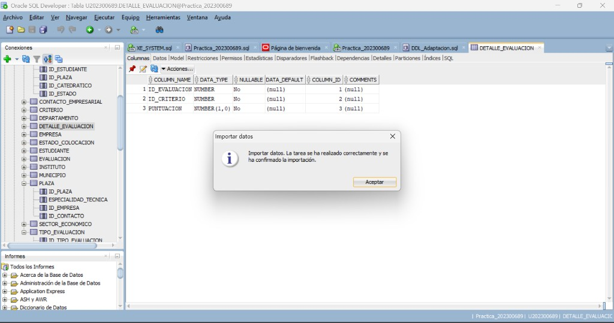

*Figura 8d. Importación confirmada de `DETALLE_EVALUACION`, última tabla del orden de carga.*

### F. Conteos de control

```sql
SELECT 'SECTOR_ECONOMICO' t, COUNT(*) n FROM SECTOR_ECONOMICO UNION ALL
SELECT 'DEPARTAMENTO', COUNT(*) FROM DEPARTAMENTO UNION ALL
SELECT 'MUNICIPIO', COUNT(*) FROM MUNICIPIO UNION ALL
SELECT 'ESTADO_COLOCACION', COUNT(*) FROM ESTADO_COLOCACION UNION ALL
SELECT 'TIPO_EVALUACION', COUNT(*) FROM TIPO_EVALUACION UNION ALL
SELECT 'CRITERIO', COUNT(*) FROM CRITERIO UNION ALL
SELECT 'INSTITUTO', COUNT(*) FROM INSTITUTO UNION ALL
SELECT 'EMPRESA', COUNT(*) FROM EMPRESA UNION ALL
SELECT 'CATEDRATICO', COUNT(*) FROM CATEDRATICO UNION ALL
SELECT 'CONTACTO_EMPRESARIAL', COUNT(*) FROM CONTACTO_EMPRESARIAL UNION ALL
SELECT 'ESTUDIANTE', COUNT(*) FROM ESTUDIANTE UNION ALL
SELECT 'PLAZA', COUNT(*) FROM PLAZA UNION ALL
SELECT 'COLOCACION', COUNT(*) FROM COLOCACION UNION ALL
SELECT 'BITACORA', COUNT(*) FROM BITACORA UNION ALL
SELECT 'EVALUACION', COUNT(*) FROM EVALUACION UNION ALL
SELECT 'DETALLE_EVALUACION', COUNT(*) FROM DETALLE_EVALUACION;
```

Valores esperados: 5, 4, 8, 3, 2, 5, 3, 5, 5, 7, 7, 7, 7, 9, 4, 17.

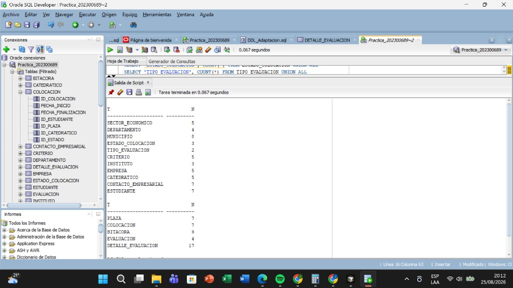

*Figura 9. `COUNT(*)` por tabla: 16 filas de control. Coinciden con el dataset (`PLAZA` 7, `COLOCACION` 7, `BITACORA` 9, `EVALUACION` 4, `DETALLE_EVALUACION` 17).*

---

# 3. Consultas DQL

Convenciones: solo `SELECT`; `INNER JOIN` / `LEFT JOIN` explícitos; alias en español para las capturas. Ejecutar cada `ConsultaN.sql` con F5/F9 sobre el esquema ya poblado.

---

## 3.1 Consulta 1 — Directorio de estudiantes activos

**Archivo:** `Consulta1.sql`

**Requerimiento:** carné, nombre completo, empresa y especialidad de la plaza; solo colocaciones `"Activa"`.

**Camino:** `ESTUDIANTE` —(`carne` = `id_estudiante`)→ `COLOCACION` → `ESTADO_COLOCACION` → `PLAZA` → `EMPRESA`.

El estado **no** se compara contra un número mágico en `COLOCACION`: se filtra `ec.nombre = 'Activa'` (id 1 en el catálogo). La especialidad sale de `PLAZA.especialidad_tecnica`.

```sql
SELECT
    e.carne                     AS carne,
    e.nombre_completo           AS nombre_estudiante,
    em.nombre                   AS nombre_empresa,
    p.especialidad_tecnica      AS especialidad_plaza
FROM ESTUDIANTE e
INNER JOIN COLOCACION c
    ON e.carne = c.id_estudiante
INNER JOIN ESTADO_COLOCACION ec
    ON c.id_estado = ec.id_estado
INNER JOIN PLAZA p
    ON c.id_plaza = p.id_plaza
INNER JOIN EMPRESA em
    ON p.id_empresa = em.id_empresa
WHERE ec.nombre = 'Activa'
ORDER BY e.carne;
```

**Resultado esperado con el dataset (5 filas):** Diego López (TechNova, Desarrollo de Software Web), María Aguilar (Industrias La Aurora, Mantenimiento Eléctrico Industrial), Sara Pinzón (Servicios Contables GT, Asistente Contable y Auditoría), Fernando Cruz (Agropecuaria El Sol, Mantenimiento de Maquinaria Agrícola), Andrés Barrios (FinTech Guatemala, Desarrollador Backend Junior). Pedro Samayoa y Gabriela Soto no aparecen: sus colocaciones están `Finalizada`.

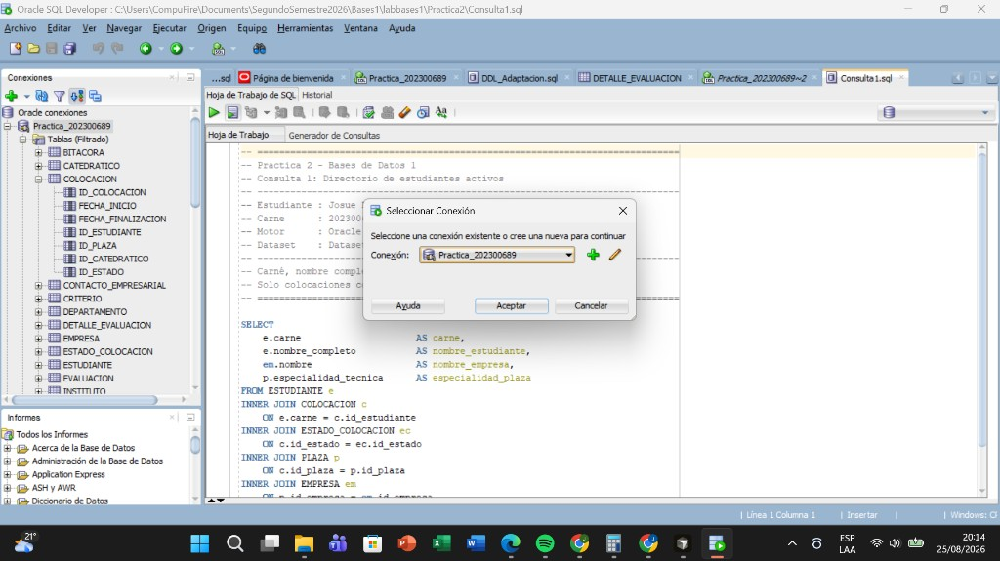

*Figura 10. `Consulta1.sql` abierto sobre la conexión `Practica_202300689`.*

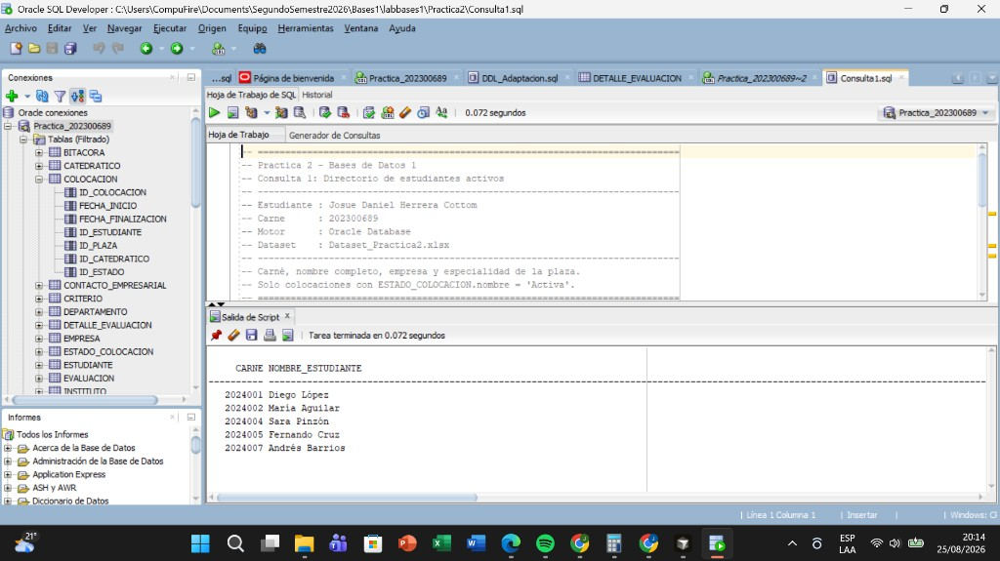

*Figura 11. Cinco estudiantes con colocación Activa (carné y nombre).*

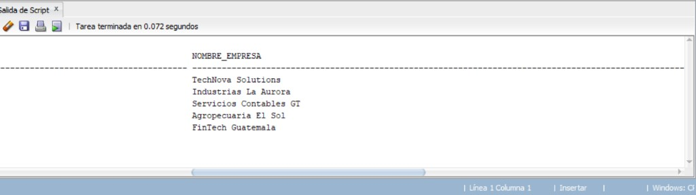

*Figura 11b. Columna `NOMBRE_EMPRESA` del mismo resultado.*

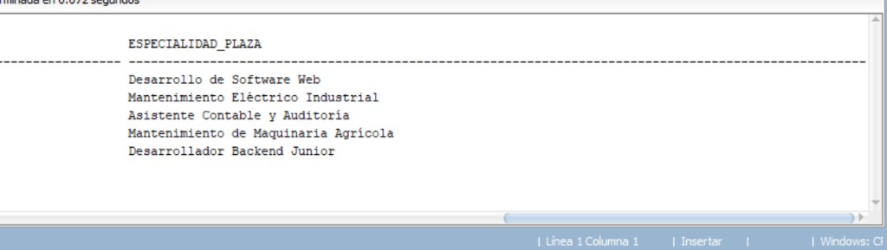

*Figura 11c. Columna `ESPECIALIDAD_PLAZA` del mismo resultado.*

---

## 3.2 Consulta 2 — Oferta de plazas por empresa

**Archivo:** `Consulta2.sql`

**Requerimiento:** nombre de cada empresa y cantidad de plazas; primero las que más ofrecen.

`COUNT(p.id_plaza)` + `GROUP BY em.id_empresa, em.nombre`. Se agrupa también por el ID para no fusionar empresas homónimas. `ORDER BY total_plazas DESC`.

```sql
SELECT
    em.nombre               AS nombre_empresa,
    COUNT(p.id_plaza)       AS total_plazas
FROM EMPRESA em
INNER JOIN PLAZA p
    ON em.id_empresa = p.id_empresa
GROUP BY
    em.id_empresa,
    em.nombre
ORDER BY
    total_plazas DESC,
    em.nombre;
```

**Resultado esperado:** FinTech Guatemala (2), TechNova Solutions (2), Agropecuaria El Sol (1), Industrias La Aurora (1), Servicios Contables GT (1).

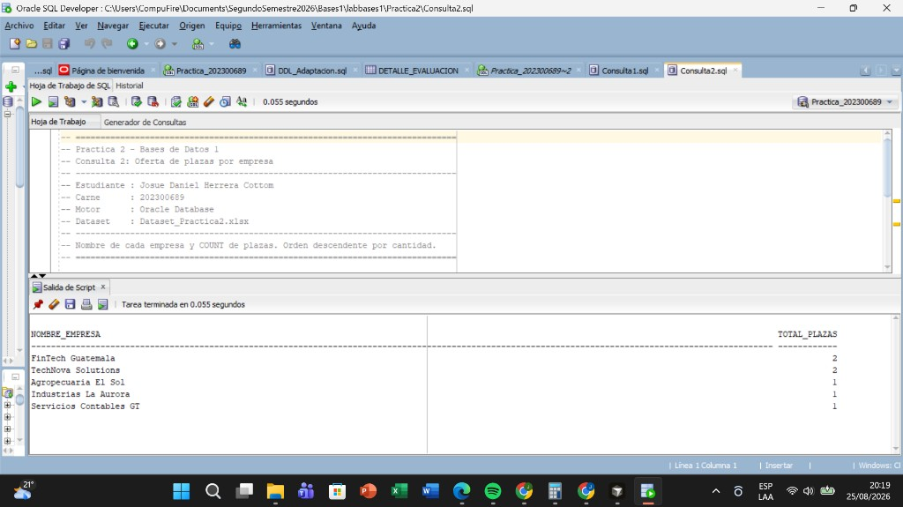

*Figura 12. `Consulta2.sql`: ranking de plazas por empresa (FinTech y TechNova con 2; las demás con 1).*

---

## 3.3 Consulta 3 — Carga de validación por contacto (julio–agosto 2026)

**Archivo:** `Consulta3.sql`

**Requerimiento:** contacto, empresa y suma de horas validadas entre el 1 de julio y el 31 de agosto de 2026.

La FK de validación en el dataset se llama `id_contacto_validador` (no `id_contacto`). El rango usa literales ANSI, independientes de `NLS_DATE_FORMAT`:

`BETWEEN DATE '2026-07-01' AND DATE '2026-08-31'`

```sql
SELECT
    ce.nombre                       AS nombre_contacto,
    em.nombre                       AS nombre_empresa,
    SUM(b.horas_trabajadas)         AS total_horas_validadas
FROM BITACORA b
INNER JOIN CONTACTO_EMPRESARIAL ce
    ON b.id_contacto_validador = ce.id_contacto
INNER JOIN EMPRESA em
    ON ce.id_empresa = em.id_empresa
WHERE b.fecha BETWEEN DATE '2026-07-01' AND DATE '2026-08-31'
GROUP BY
    ce.id_contacto,
    ce.nombre,
    em.nombre
ORDER BY
    total_horas_validadas DESC,
    ce.nombre;
```

**Resultado esperado (todas las 9 bitácoras caen en el rango):** Ana Morales / TechNova / 16; Mario Pineda / FinTech / 16; Sofía Valdez / Agropecuaria El Sol / 16; Carlos Fuentes / Industrias La Aurora / 14; Diana Rosales / FinTech / 6.

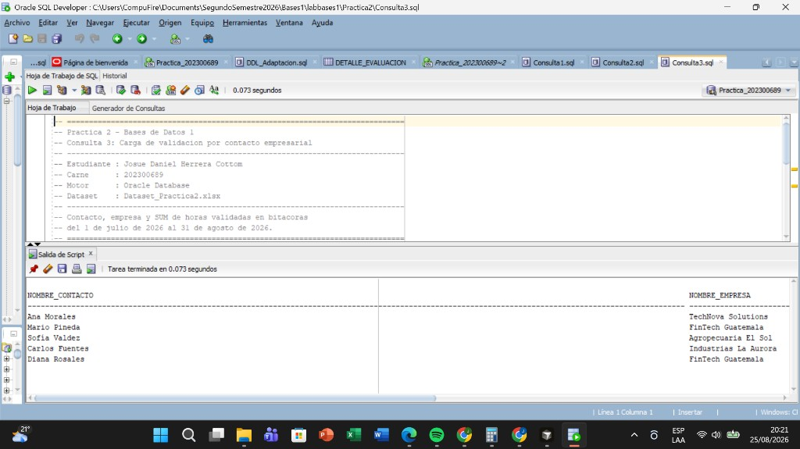

*Figura 14. `Consulta3.sql`: contactos y empresas (julio–agosto 2026).*

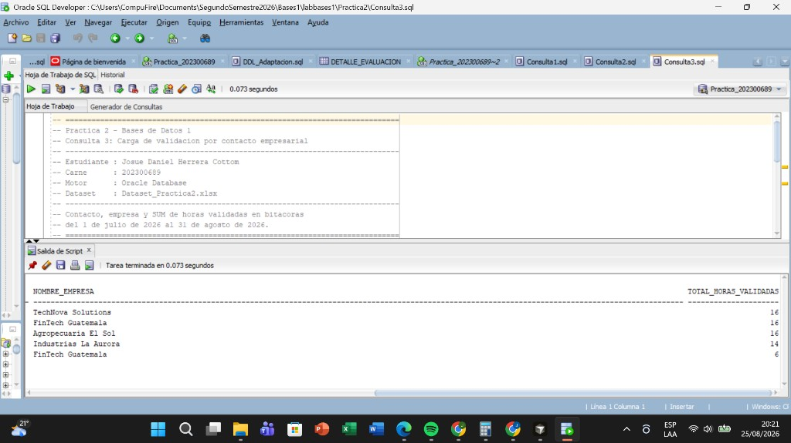

*Figura 15. Suma de horas validadas: 16, 16, 16, 14 y 6. FinTech aparece dos veces porque son dos contactos distintos (Mario Pineda y Diana Rosales).*

---

## 3.4 Consulta 4 — Estudiantes en repitencia

**Archivo:** `Consulta4.sql`

**Requerimiento:** `es_repitencia = 1`; nombre del estudiante, instituto de procedencia, contacto que valida bitácoras y estado actual de la colocación.

En P1 el instituto se infería por `COLOCACION → CATEDRATICO → INSTITUTO`. El dataset **sí** trae `ESTUDIANTE.id_instituto`; esa es la procedencia que pide el reporte.

En el Excel solo Pedro Samayoa tiene `es_repitencia = 1`. Su colocación (id 3) está `Finalizada` y **no tiene bitácoras**. Por eso se usa `LEFT JOIN` a `BITACORA` y `NVL(contacto_validador, contacto_de_la_plaza)`: si nadie ha validado entradas, se reporta el contacto responsable de la plaza (Jorge Cifuentes). `DISTINCT` evita una fila por cada bitácora cuando sí las hay.

```sql
SELECT DISTINCT
    e.nombre_completo                           AS nombre_estudiante,
    i.nombre                                    AS nombre_instituto,
    NVL(ce_val.nombre, ce_plz.nombre)           AS contacto_validador,
    ec.nombre                                   AS estado_colocacion
FROM ESTUDIANTE e
INNER JOIN INSTITUTO i
    ON e.id_instituto = i.id_instituto
INNER JOIN COLOCACION c
    ON e.carne = c.id_estudiante
INNER JOIN ESTADO_COLOCACION ec
    ON c.id_estado = ec.id_estado
INNER JOIN PLAZA p
    ON c.id_plaza = p.id_plaza
INNER JOIN CONTACTO_EMPRESARIAL ce_plz
    ON p.id_contacto = ce_plz.id_contacto
LEFT JOIN BITACORA b
    ON c.id_colocacion = b.id_colocacion
LEFT JOIN CONTACTO_EMPRESARIAL ce_val
    ON b.id_contacto_validador = ce_val.id_contacto
WHERE e.es_repitencia = 1
ORDER BY
    e.nombre_completo,
    ec.nombre;
```

**Resultado esperado (1 fila):** Pedro Samayoa | Instituto Técnico de Computación (ITC) | Jorge Cifuentes | Finalizada.

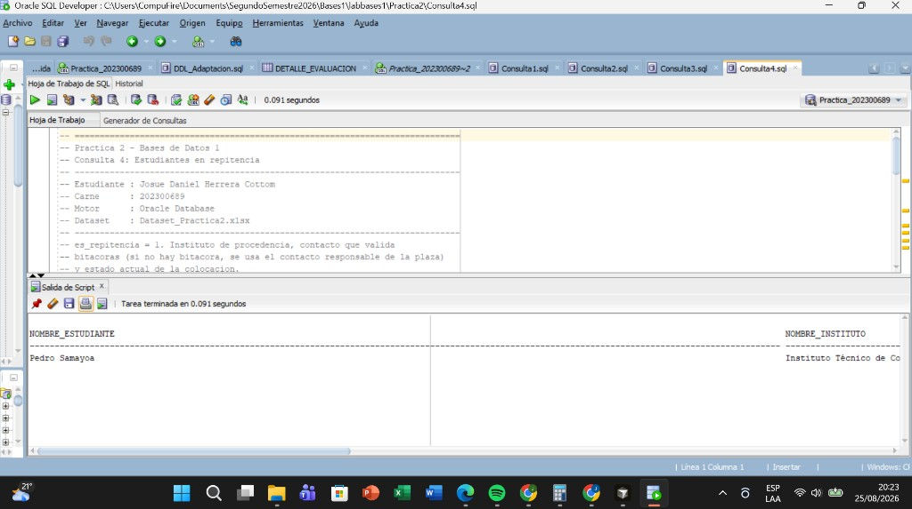

*Figura 16. `Consulta4.sql`: único estudiante con `es_repitencia = 1` (Pedro Samayoa).*

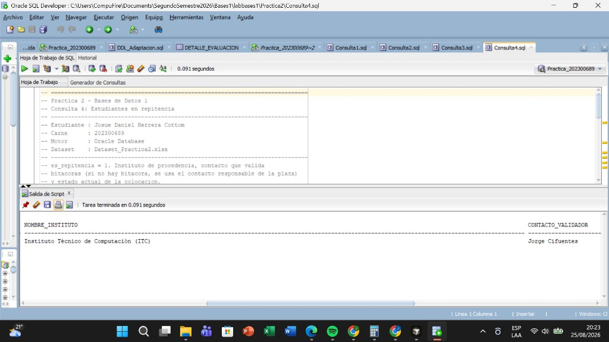

*Figura 17. Instituto de procedencia (ITC) y contacto validador (Jorge Cifuentes, responsable de la plaza).*

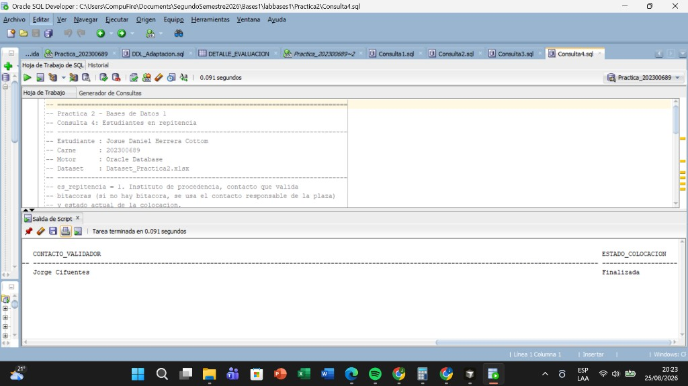

*Figura 17b. Estado actual de su colocación: Finalizada.*

---

## 3.5 Consulta 5 — Auditoría de bitácoras (último mes)

**Archivo:** `Consulta5.sql`

**Requerimiento:** colocaciones `"Activa"` **sin** ningún registro en `BITACORA` durante el último mes; mostrar al catedrático supervisor para el llamado de atención.

Un `INNER JOIN` a bitácora listaría a quienes **sí** registraron. El patrón correcto es un **anti-join** con `NOT EXISTS` (el enunciado también acepta `LEFT JOIN ... IS NULL`).

Ventana: desde `ADD_MONTHS(TRUNC(SYSDATE), -1)` hasta el día de ejecución. Con fecha del sistema 25-ago-2026 eso cubre del 25-jul-2026 al 25-ago-2026.

Se incluyen `id_colocacion` y el estudiante además del catedrático: un mismo supervisor puede tener varias colocaciones incumplidas.

```sql
SELECT
    c.id_colocacion         AS id_colocacion,
    e.carne                 AS carne,
    e.nombre_completo       AS nombre_estudiante,
    cat.nombre              AS catedratico_supervisor
FROM COLOCACION c
INNER JOIN ESTADO_COLOCACION ec
    ON c.id_estado = ec.id_estado
INNER JOIN ESTUDIANTE e
    ON c.id_estudiante = e.carne
INNER JOIN CATEDRATICO cat
    ON c.id_catedratico = cat.id_catedratico
WHERE ec.nombre = 'Activa'
  AND NOT EXISTS (
        SELECT 1
        FROM BITACORA b
        WHERE b.id_colocacion = c.id_colocacion
          AND b.fecha >= ADD_MONTHS(TRUNC(SYSDATE), -1)
          AND b.fecha <  TRUNC(SYSDATE) + 1
      )
ORDER BY
    cat.nombre,
    e.carne;
```

**Resultado esperado al 25-ago-2026 (3 filas):**

| Colocación | Estudiante | Motivo | Catedrático |
|---|---|---|---|
| 1 | Diego López | Bitácoras del 1 y 2 de julio (fuera de la ventana) | Julio César Pérez |
| 2 | María Aguilar | Bitácoras del 15 y 16 de julio (fuera de la ventana) | Marta Estrada |
| 4 | Sara Pinzón | Sin ninguna bitácora | Roberto Gómez |

Fernando Cruz (col. 5, 1–2 ago) y Andrés Barrios (col. 7, 15 ago) **no** salen: sí tienen bitácora en el último mes.

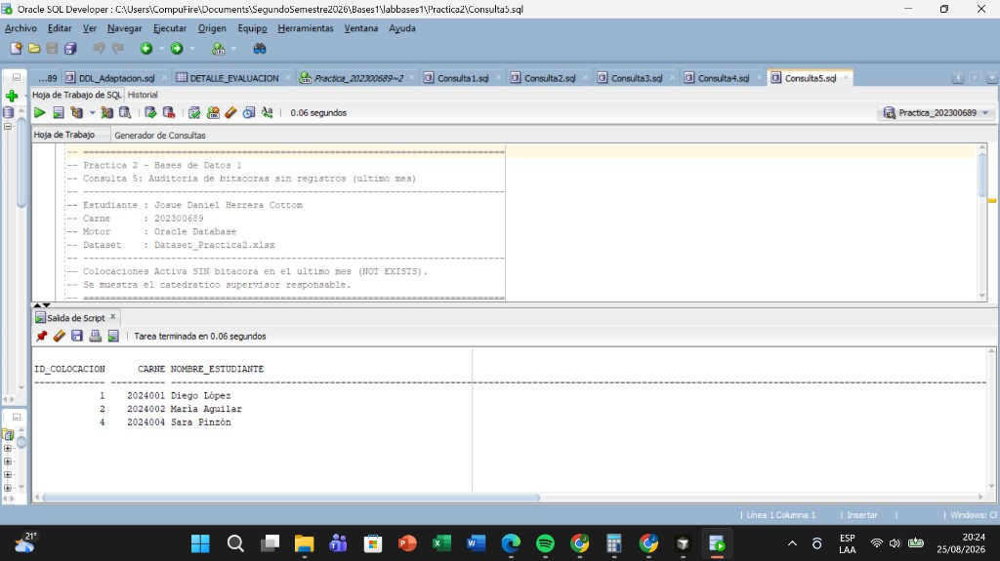

*Figura 18. `Consulta5.sql`: colocaciones activas 1, 2 y 4 sin bitácora en el último mes.*

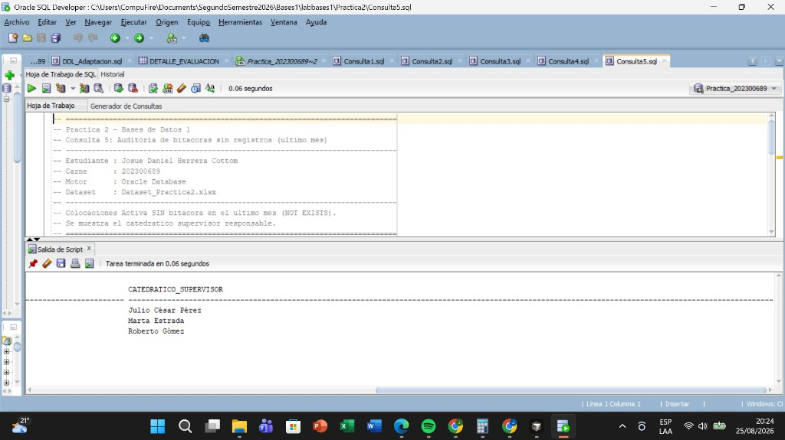

*Figura 19. Catedráticos responsables: Julio César Pérez, Marta Estrada y Roberto Gómez.*

---

# 4. Conclusiones

1. P2 se construye sobre P1, pero el Excel oficial obliga a normalizar catálogos y a renombrar columnas. Esa adaptación cubre el criterio de importación de la rúbrica.
2. El orden de carga sigue las llaves foráneas. `PLAZA` se importa antes de `COLOCACION` aunque el §3.3 del enunciado no la numere.
3. Las consultas 2 y 3 usan agregación (`COUNT`, `SUM` y `GROUP BY`). La 5 usa un anti-join (`NOT EXISTS`). Las consultas 1 y 4 recorren el modelo de negocio con JOIN explícitos.
4. Los literales `DATE 'YYYY-MM-DD'` y `ADD_MONTHS`/`TRUNC` hacen las consultas reproducibles en Oracle.
