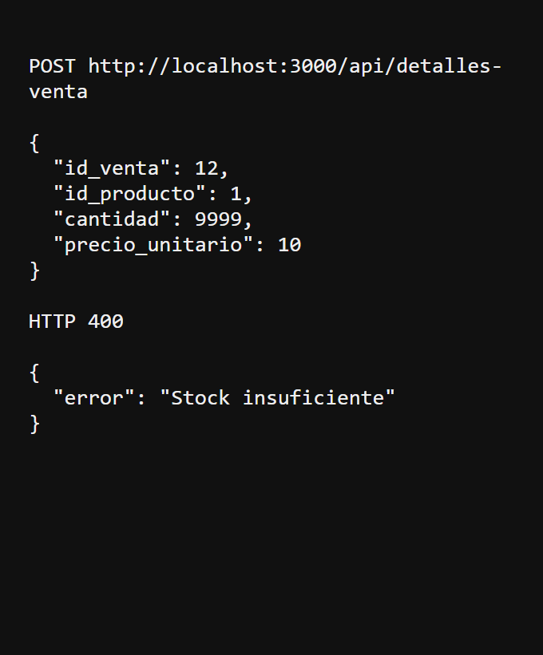
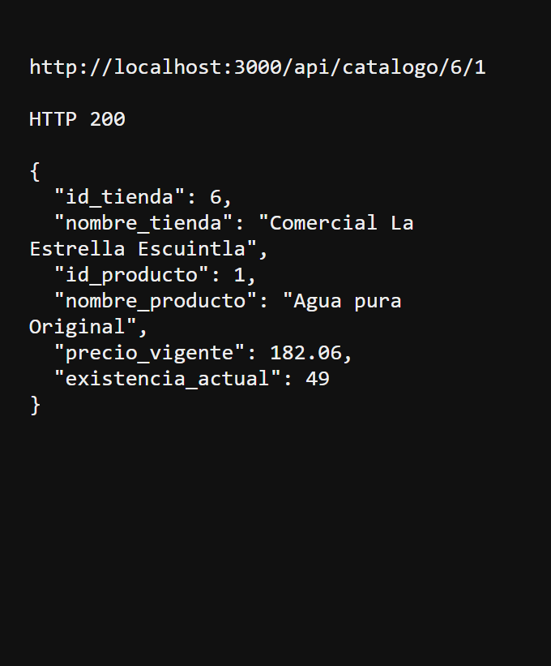
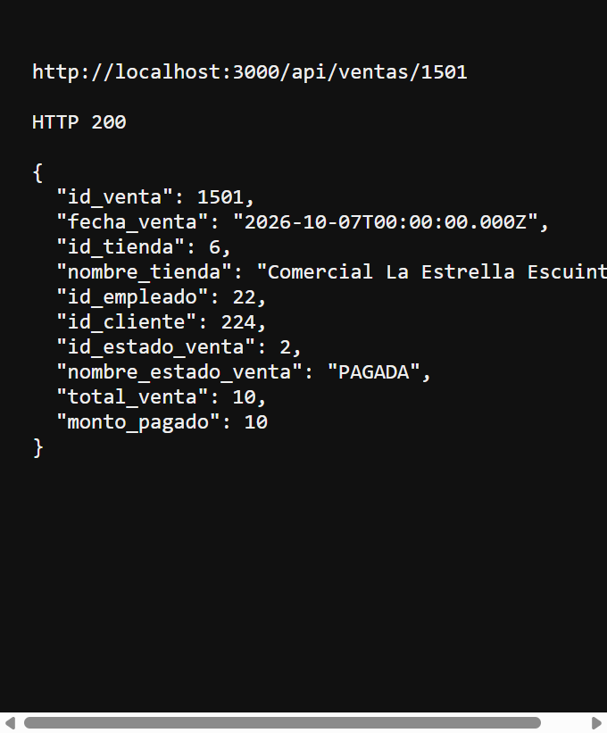

# Fase 2 — Comercial La Estrella

Josue Daniel Herrera Cottom — 202300689

Repositorio: https://github.com/JosueDanielHC/202300689_LAB_SBD1_2S2026.git

La Fase 1 permanece en `../Proyecto1` y usa Oracle. Esta carpeta es solo la Fase 2: SQL Server 2022 en Docker, triggers, vistas y API REST en Node.js. Todo el CRUD se hace por la API. DBeaver queda para mirar la estructura, en solo lectura.

## 1. Requisitos

- Docker Desktop con el motor en marcha (abajo debe decir Engine running)
- Node.js 20
- Postman, para las pruebas de creación y de triggers

## 2. Levantar la base

Abrir PowerShell en esta carpeta y ejecutar:

```powershell
docker compose up -d
```

La primera vez el servicio `db-init` crea la base `ComercialLaEstrella`, carga el dataset de la Fase 1 y después crea los triggers y las vistas. Cuando termina, el contenedor `estrella-db-init` queda detenido. Eso es normal. `estrella-sqlserver` debe seguir en ejecución, con el puerto `1433`.

Si la base ya existe, `init.sql` no se vuelve a ejecutar. Para empezar de cero:

```powershell
docker compose down -v
docker compose up -d
```

Conexión de solo lectura:

| Campo | Valor |
| --- | --- |
| Host | `localhost` |
| Puerto | `1433` |
| Usuario | `sa` |
| Contraseña | `LaEstrella#2026` |
| Base | `ComercialLaEstrella` |

## 3. Levantar la API

```powershell
cd api
npm install
npm start
```

La API escucha en `http://localhost:3000` y responde JSON. La raíz lista las rutas. Ejemplos:

- `http://localhost:3000/api/clientes`
- `http://localhost:3000/api/reportes/ventas-ubicacion`
- `http://localhost:3000/api/reportes/top-productos`
- `http://localhost:3000/api/reportes/saldos-pendientes`

Los reportes hacen `SELECT *` de las vistas. Los JOIN están en SQL Server, no en Node.js.

La contraseña en `api/.env` va entre comillas porque contiene `#`:

```text
DB_PASSWORD="LaEstrella#2026"
```

## 4. Postman

Importar `postman/ComercialLaEstrella.postman_collection.json`.

La carpeta **Prueba de triggers** se ejecuta de arriba hacia abajo:

1. Ver la existencia del producto 1 en la tienda 6.
2. Crear una venta registrada. Postman guarda `id_venta`.
3. Pedir 9999 unidades. La respuesta debe ser HTTP 400 con `Stock insuficiente`.
4. Pedir 1 unidad. La respuesta debe ser HTTP 201.
5. Consultar el catálogo. La existencia baja en 1.
6. Abonar 4. La venta sigue en `REGISTRADA`.
7. Abonar 6, que completa el total de 10.
8. Consultar la venta. El estado debe ser `PAGADA`. Ese cambio lo hace el trigger `Insert_Pago`, no la API.

Las carpetas de clientes, tiendas, empleados y productos incluyen listar, obtener, crear, actualizar y eliminar.

## 5. Qué hace cada objeto

`Insert_Detalle`, sobre `detalle_venta`: suma la cantidad pedida y la compara con `catalogo_producto.existencia_actual` de la tienda de esa venta. Si no hay fila de catálogo o la cantidad es mayor, hace `RAISERROR` y `ROLLBACK`. Si alcanza, descuenta el inventario.

`Insert_Pago`, sobre `pago`: suma los pagos de la venta. Si cubren o superan `SUM(detalle_venta.subtotal)` y el estado es `REGISTRADA`, cambia el estado a `PAGADA`.

`Vista_Ventas_Ubicacion`: tienda, municipio, departamento, país, cantidad de ventas y total facturado. No cuenta las ventas `ANULADA`.

`Vista_Top_Productos`: código, nombre, categoría, marca, unidades vendidas y monto. No cuenta las ventas `ANULADA`.

`Vista_Saldos_Pendientes`: solo ventas `REGISTRADA`, con total, monto pagado y saldo pendiente.

El precio y la existencia no están en `producto`. Están en `catalogo_producto`, por tienda, igual que en la Fase 1. El correo admite varios nulos mediante un índice único filtrado, porque SQL Server en un `UNIQUE` normal solo admite un `NULL`.

## 6. Capturas de los triggers

Estas respuestas salieron de la API con la base en marcha.

Venta de prueba conservada para poder mostrarla: **1501**, tienda 6, producto 1 (Agua pura Original). Antes de la venta la existencia era 50.

Pedido rechazado por el trigger de inventario:



Después de vender 1 unidad, la existencia quedó en 49:



Al cubrir el total de 10, el trigger de pagos dejó la venta en PAGADA:



Esas filas de prueba están en la base que ya está corriendo. `init.sql` sigue teniendo el dataset original. `docker compose down -v` seguido de `docker compose up -d` vuelve a cargar ese dataset y borra la venta 1501.

## 7. Para explicar en la defensa

La API no calcula totales ni valida el inventario. Esas reglas viven en SQL Server.

`Insert_Detalle` es un trigger `AFTER INSERT`. SQL Server llena la tabla temporal `inserted` con la fila que acaba de entrar. El trigger une esa fila con `venta` para saber la tienda, y con `catalogo_producto` para leer `existencia_actual`. Si la cantidad pedida es mayor, ejecuta `RAISERROR` y `ROLLBACK TRANSACTION`: la fila del detalle no queda guardada y el inventario no cambia. La API lee ese error y responde HTTP 400 con el texto `Stock insuficiente`. Si la cantidad alcanza, el mismo trigger resta la cantidad vendida.

`Insert_Pago` también es `AFTER INSERT` y también usa `inserted`, para saber qué ventas recibieron un pago. Suma `pago.monto` y lo compara con `SUM(detalle_venta.subtotal)`. El total no está guardado en `venta`. Si la suma cubre el total y el estado actual es `REGISTRADA`, actualiza `id_estado_venta` al id de `PAGADA`. Un abono parcial no cambia el estado.

`Vista_Ventas_Ubicacion` une tienda, municipio, departamento y país. Cuenta ventas y suma subtotales, dejando fuera el estado `ANULADA`.

`Vista_Top_Productos` une detalle, venta, producto, categoría y marca. Suma unidades y monto, también sin las ventas anuladas.

`Vista_Saldos_Pendientes` filtra `REGISTRADA`. Muestra el total, la suma de abonos y la resta de ambos.

En Docker, `docker compose up -d` levanta SQL Server 2022. El servicio `db-init` corre `init.sql` una sola vez, porque la imagen oficial no ejecuta scripts al arrancar. La API toma servidor, puerto, usuario y contraseña de `api/.env`, no los escribe en el código.
